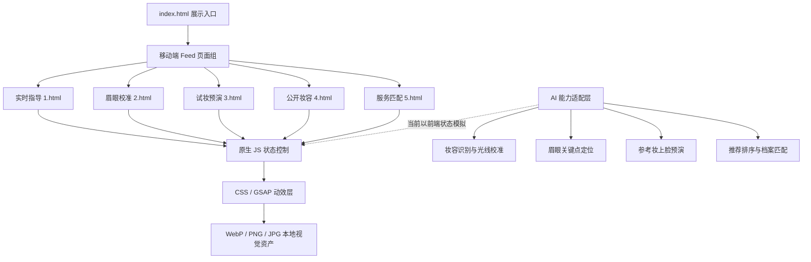

# Face Muse 技术说明

赛道编号：T3  
团队名称：用中文回答我  
作品名称：Face Muse  
提交格式：Markdown

## 一、项目概述

Face Muse 是面向美妆新手的移动端 AI 妆容体验原型，核心目标是把“看内容”和“开始使用”合并到同一个 feed 场景中。用户不需要先搜索教程、再收藏、再打开工具，而是在刷到推荐卡片时直接完成实时校准、上脸预演、步骤拆解、公开复用和服务匹配。

作品当前以高保真静态前端实现，`index.html` 作为五页轮播展示入口，覆盖 5 个关键体验页：

- `1.html`：实时妆容指导，展示步骤、光线、定位和语音提示状态。
- `2.html`：眉眼校准，围绕定位、补空、复查给出即时指导。
- `3.html`：收藏妆上脸预演，将参考妆容拆成 4 步练习。
- `4.html`：公开妆容与美力榜，支持一键使用公开妆并形成激励闭环。
- `5.html`：高分化妆师与妆造档案，根据偏好、距离、评分进行推荐。

展示入口通过 iframe 横向轮播聚合 5 个移动端竖屏页面，模拟用户连续刷卡浏览与即时使用的完整路径。入口支持居中翻页按钮、键盘方向键与拖拽翻页，评审可直接打开入口文件体验完整作品。

## 二、体验设计：“刷到即用”

Face Muse 的体验重点不是把 AI 做成单独工具页，而是让 AI 结果直接出现在用户正在浏览的内容流里。每张卡片都同时承担“推荐内容”和“可操作工具”的职责。

用户路径如下：

1. 刷到实时指导卡：系统显示当前步骤、光线状态、定位目标和语音开关，用户可直接点击“重新校准”或“开始下一步”。
2. 刷到眉眼校准卡：AI 将眉峰、眉尾、睫毛角度拆成“定位 / 补空 / 复查”三个状态，用户点选状态即可获得对应指导文案。
3. 刷到收藏妆试脸卡：用户在“参考图”和“自拍视频”之间切换，查看妆容在自己脸上的适配效果，并保存 4 步练习。
4. 刷到公开妆容卡：其他用户发布的妆容可以被“一键使用”，发布者获得美力值，形成内容供给激励。
5. 刷到服务匹配卡：系统基于历史妆造档案、距离、评分和风格偏好推荐化妆师或工作室。

这种设计降低了使用门槛：用户刷到内容即获得上下文，看到建议即能操作，完成操作后又能沉淀为练习、公开妆或个人妆造档案。

## 三、技术架构



当前项目采用纯前端架构：HTML、CSS、原生 JavaScript 与本地 GSAP 动效库，无后端请求、构建链或真实模型调用。体验页按 887 × 1920 的移动端设计稿比例构建，通过 CSS 变量和 `rem` 缩放适配不同视口；展示入口负责页面聚合与翻页交互，业务页负责各自的状态模拟和即时反馈。

AI 能力在当前原型中以交互状态和视觉反馈模拟。后续真实接入时，模型服务只需要输出结构化状态，例如识别结果、推荐理由、下一步动作和置信度，前端即可复用现有状态层完成即时渲染。

### AI 能力使用方式

| AI 输入信号 | 输出状态 | 即时 UI 动作 |
| --- | --- | --- |
| 摄像头帧、人脸区域、光照情况 | `lightStatus`、`skinToneDelta`、`nextAction` | 更新光线状态、肤色采样结果和下一步动作提示 |
| 眉眼关键点、眉笔位置、镜框遮挡 | `browPeak`、`browTailGap`、`lashAngle` | 更新扫描标签、眉尾空隙、睫毛角度和语音指导 |
| 参考妆图片、自拍视频、面部比例 | `tryOnPreview`、`fitScore`、`adjustments` | 展示上脸预演、适配度和妆效调整理由 |
| 收藏妆容、面部分区、妆效标签 | `practiceSteps`、`currentStep` | 生成底妆、眼影、腮红、唇线等分步练习 |
| 历史档案、距离、评分、风格偏好 | `rankedStudios`、`matchReason` | 更新化妆师排序、匹配度和推荐说明 |

AI 在体验中的定位是“即时决策引擎”：识别用户当前状态，生成下一步建议，并把建议转成用户可以立刻点击、保存或复用的界面状态。

## 四、核心实现

### 1. Feed 聚合与懒加载

`index.html` 使用 iframe 聚合 5 个业务页面，仅在页面切换到对应索引时写入 `src`，减少首屏加载压力。容器支持居中上一页/下一页按钮、键盘方向键和 pointer 拖拽，模拟短视频 feed 中连续浏览的操作方式；按钮点击会阻止事件继续冒泡，避免翻页按钮被误判为拖拽起点。

```js
const loadFrame = (index) => {
  const frame = frames[clampIndex(index)];
  if (frame && !frame.hasAttribute("src")) {
    frame.src = frame.dataset.src;
  }
};

const render = (index, offset = 0) => {
  currentIndex = clampIndex(index);
  loadFrame(currentIndex);
  track.style.transform =
    `translate3d(calc(${-currentIndex * 100}% + ${offset}px), 0, 0)`;
};

prevButton.addEventListener("click", (event) => {
  event.stopPropagation();
  goTo(currentIndex - 1);
});
```

### 2. 页面状态驱动 UI

各业务页使用轻量状态对象驱动界面。例如 `1.html` 维护当前步骤、目标区域、提示语和记录文案；`2.html` 维护 `position / fill / review` 三种模式；`3.html` 维护当前选中的参考图、自拍视频和练习步骤。状态变化只更新必要 DOM，符合 KISS 和 YAGNI 原则。

眉眼校准页的 `setMode()` 是 AI 状态驱动界面的核心模式：模型输出的模式可以直接映射为 `position / fill / review`，再同步按钮、扫描标签、指导文案和无障碍状态。

```js
const setMode = (mode) => {
  const next = modes[mode] || modes.position;

  tabs.forEach((tab) => {
    const isActive = tab.dataset.mode === mode;
    tab.classList.toggle("is-active", isActive);
    tab.setAttribute("aria-pressed", String(isActive));
  });

  tags.forEach((tag) => {
    tag.classList.toggle("is-active", tag.dataset.tag === mode);
  });

  setText(coachCopy, next.copy);
  setText(primaryGuidance, next.primary);
  setText(voiceGuidance, next.voice);
};
```

### 3. 即时反馈与无障碍

按钮操作会同步更新 `aria-pressed`、`aria-live` 文案和视觉状态，用户可以通过点击或键盘触发同一逻辑。动效使用 `transform` 和 `opacity`，并通过 `prefers-reduced-motion` 为减少动态效果的用户提供降级路径。

### 4. 资源与性能策略

关键首屏图片使用 `preload`、`fetchpriority="high"`、明确宽高和 `decoding`；非首屏图片使用 `loading="lazy"`。GSAP 在部分页面中延迟或异步加载，用于入场动效、按钮反馈和提示强调，不阻塞核心内容展示。

## 五、作品亮点

- 刷到即用：AI 能力不隐藏在工具入口后，而是直接嵌入 feed 卡片。
- 即时指导：从光线、眉峰、眉尾、睫毛角度到下一步动作，反馈都以可执行文案呈现。
- 低门槛试妆：收藏妆容可直接预演到自拍视频，并拆成可练习步骤。
- 内容激励闭环：公开妆容被一键使用后形成美力值奖励，提升内容生产动力。
- 档案沉淀：每次试妆和服务选择都可进入个人妆造档案，持续改善推荐质量。
- 前端轻量：无框架、无构建链，核心逻辑集中在原生 JS 状态控制，方便评审直接打开验证。

## 六、已知局限与后续规划

当前版本是高保真前端原型，AI 能力以静态数据和交互状态模拟呈现，尚未接入真实摄像头、真实人脸关键点检测、试妆生成模型和后端推荐服务。

后续规划：

1. 接入摄像头权限与实时人脸关键点检测，完成光线、眉眼和脸部区域的真实识别。
2. 接入试妆生成模型，实现参考妆到用户自拍视频的实时迁移。
3. 建立用户妆造档案服务，记录历史试妆、偏好标签和避坑建议。
4. 将公开妆容、使用次数和美力值接入后端，形成真实激励系统。
5. 对 5 个页面抽取共享 Feed 组件，减少内联重复代码，提升后续维护效率。

以上规划保持当前原型的简单架构边界：前端继续负责体验表达和即时反馈，AI 与后端服务通过稳定的数据结构向页面状态层输出结果。
